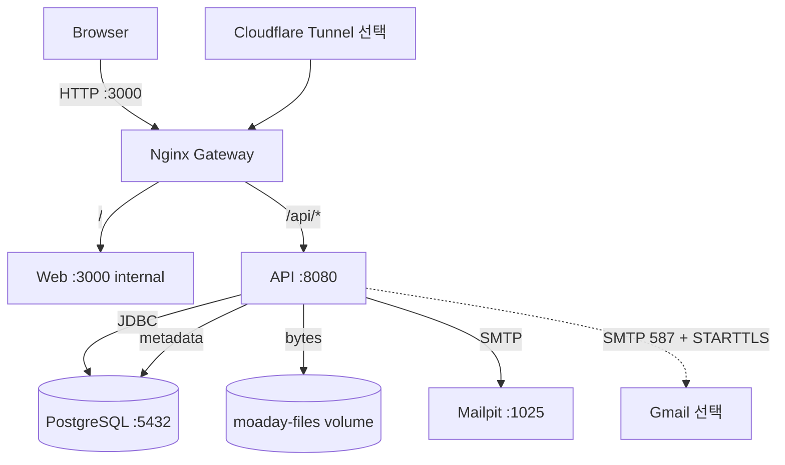
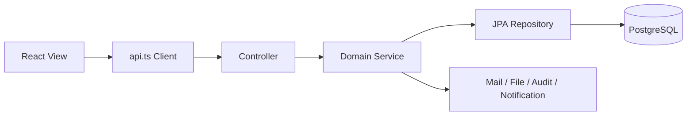
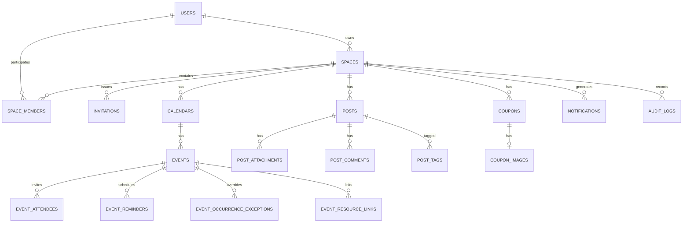
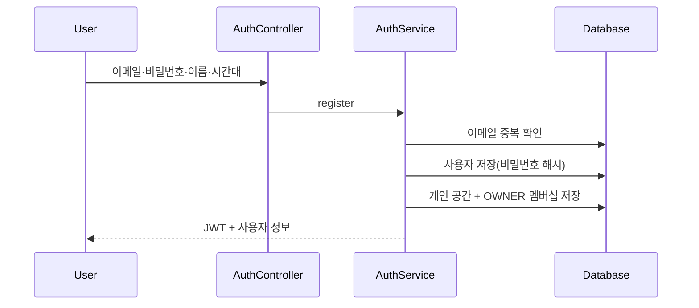
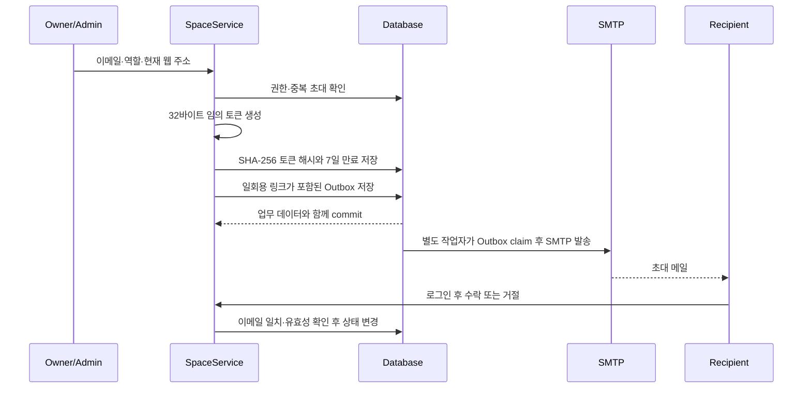
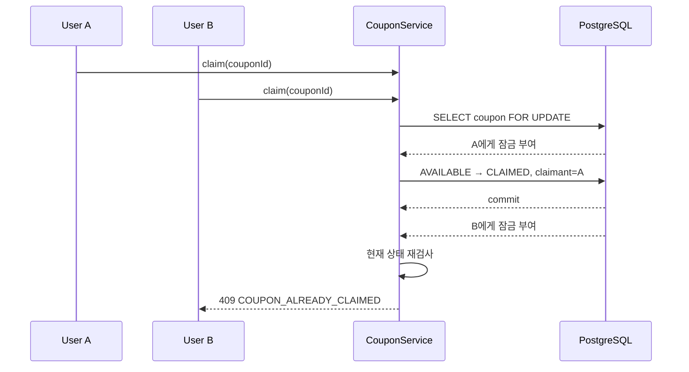

# MoaDay 현재 구현 상세 설계서

## 1. 문서 목적

이 문서는 MoaDay 저장소의 현재 구현 구조를 설명합니다. 미래 지향 설계 초안인 `PRODUCT_DESIGN.md`, `TECHNICAL_SPEC.md`와 달리 실제 코드, Docker 구성과 Flyway V1~V13을 기준으로 합니다.

## 2. 기술 스택

| 계층 | 기술 |
| --- | --- |
| Web | React 19, TypeScript 5.9, Vinext/Vite, CSS Modules, JsBarcode |
| API | Java 21, Spring Boot 4.1, Spring MVC, Validation, Security, OAuth2 Resource Server |
| Persistence | Spring Data JPA, Hibernate, PostgreSQL 17, Flyway |
| 개발 DB | H2 PostgreSQL compatibility mode |
| Mail | Spring Mail, Mailpit, 외부 SMTP 선택 |
| File | 로컬 파일시스템/Docker 이름 있는 볼륨 |
| Gateway | Nginx Alpine |
| Tunnel | Cloudflare Quick Tunnel 선택 프로필 |
| Test | JUnit 5, Spring Boot Test, Mockito, Node Test Runner, E2E Node script |

## 3. 저장소 구조

```text
coupon_with/
├─ apps/
│  ├─ api/                    Spring Boot API
│  │  └─ src/main/java/com/couponwith/
│  │     ├─ identity/         계정·JWT
│  │     ├─ space/            공간·멤버십·초대·초대 메일
│  │     ├─ calendar/         캘린더·일정·회차 예외·ICS·연결 자료
│  │     ├─ post/             게시글·댓글·첨부파일
│  │     ├─ coupon/           쿠폰·이미지·바코드·선점
│  │     ├─ notification/     알림·환경 설정·프로필
│  │     ├─ discovery/        통합검색·대시보드
│  │     ├─ audit/            감사 로그
│  │     ├─ automation/       쿠폰·일정 주기 작업
│  │     ├─ config/           보안·스케줄링 설정
│  │     └─ common/           공통 오류 처리
│  └─ web/                    React 반응형 웹
├─ docker/gateway.conf        동일 출처 Nginx 프록시
├─ docs/                      면접·실행·요구·설계 문서
├─ scripts/                   E2E, 백업, 복원
└─ docker-compose.yml         로컬 전체 런타임
```

## 4. 런타임 아키텍처



### 요청 경로

- 브라우저는 `/api/v1` 상대 경로를 사용합니다.
- Nginx는 `/api/`를 API로, 나머지를 웹으로 전달합니다.
- 초대 링크를 만들 때 `X-Forwarded-Host`와 `X-Forwarded-Proto`를 사용해 현재 접속 기준 주소를 구성합니다.
- Docker 내부 웹 포트는 외부에 직접 노출하지 않고 Gateway만 3000 포트를 점유합니다.

## 5. 애플리케이션 계층



- Controller: HTTP 라우팅, 요청 검증, JWT subject 추출
- Service: 트랜잭션, 공간 권한, 업무 규칙, 알림·감사 호출
- Repository: 데이터 접근과 잠금
- Entity: 상태 전이와 JPA 버전 관리
- View record: API 응답에서 엔티티와 민감 필드를 분리

## 6. 인증과 보안

### 6.1 JWT

1. 회원가입 또는 로그인 성공 시 HS256 JWT를 발급합니다.
2. `sub`에는 사용자 UUID, claim에는 이메일과 이름을 넣습니다.
3. 만료는 발급 후 1시간입니다.
4. `/api/v1/auth/**`, `/actuator/health` 외 요청은 Bearer JWT가 필요합니다.
5. 서버 세션은 생성하지 않습니다.

비밀번호는 Spring Security의 위임형 PasswordEncoder로 저장하며 평문을 보관하지 않습니다.

### 6.2 공간 격리

각 도메인 서비스는 자원에서 `spaceId`를 구한 뒤 `space_members`의 `ACTIVE` 멤버십을 조회합니다. 클라이언트가 전달한 공간 ID만으로 접근을 허용하지 않습니다. 접근할 수 없는 공간은 정보 노출을 줄이기 위해 404로 응답하는 경우가 많습니다.

### 6.3 CORS

허용 출처는 `CORS_ALLOWED_ORIGINS`로 설정합니다. 로컬 Docker는 Nginx 동일 출처이므로 일반 브라우저 요청에 CORS가 개입하지 않습니다. 현재 명시된 허용 메서드에 `PUT`이 없어, 웹과 API를 서로 다른 출처로 실행하며 일정 연결 자료를 수정할 경우 보완이 필요합니다.

### 6.4 파일 보안

- 파일당 최대 20MB, 게시글당 최대 20개
- 실행 파일·스크립트·HTML·SVG의 MIME과 확장자 차단
- `MZ`, shebang, HTML·script·PHP 시작 시그니처 차단
- 원본 파일명을 저장하되 실제 경로는 UUID 저장 키 사용
- 정규화 경로가 저장소 루트 밖으로 나가면 거부
- 다운로드·쿠폰 이미지 요청마다 공간 멤버십 확인

운영 수준에서는 별도 악성코드 스캔과 오브젝트 스토리지 전환이 필요합니다.

## 7. 권한 설계

| 작업 | OWNER | ADMIN | MEMBER | VIEWER |
| --- | :---: | :---: | :---: | :---: |
| 공간 데이터 읽기 | O | O | O | O |
| 일정·게시글·댓글 작성 | O | O | O | X |
| 본인 작성 글·댓글 수정 | O | O | O | X |
| 타인 글·댓글 관리 | O | O | X | X |
| 게시글 고정 | O | O | X | X |
| 초대·구성원 관리 | O | 제한적 | X | X |
| ADMIN 지정 | O | X | X | X |
| 공간 삭제 | O | X | X | X |
| 공간 탈퇴 | X | O | O | O |

쿠폰은 `coupon_redeem_allowed`와 역할·소유권을 함께 확인합니다. 쿠폰 상태 정정은 쿠폰 소유자 또는 OWNER·ADMIN만 가능합니다.

## 8. 핵심 데이터 모델



### 테이블 그룹

| 그룹 | 테이블 | 핵심 용도 |
| --- | --- | --- |
| Identity | `users`, `user_preferences` | 계정과 알림 환경 설정 |
| Space | `spaces`, `space_members`, `invitations` | 테넌트 경계, 역할, 초대 상태 |
| Calendar | `calendars`, `events`, `event_attendees`, `event_reminders` | 일정 원본과 참석·알림 |
| Recurrence | `event_occurrence_exceptions`, `event_reminder_deliveries` | 회차 예외와 중복 알림 방지 |
| Content | `posts`, `post_tags`, `post_attachments`, `post_comments` | 공유글과 자료 |
| Coupon | `coupons`, `coupon_images` | 쿠폰 상태, 이미지와 선택적 바코드 |
| Link | `event_resource_links` | 일정과 글·파일·쿠폰 연결 |
| Operation | `notifications`, `audit_logs` | 사용자 알림과 중요 작업 이력 |

모든 시간은 DB와 API에서 UTC `Instant`로 저장·전송하고, 화면 표시와 반복 계산에서 IANA 시간대를 적용합니다.

## 9. 주요 처리 흐름

### 9.1 회원가입



### 9.2 공간 초대



DB에는 원문 토큰이 아닌 SHA-256 해시만 저장합니다. 원문은 생성 응답과 발송 링크에만 사용합니다.

### 9.3 쿠폰 선점



`CouponRepository.findForUpdate`의 `PESSIMISTIC_WRITE`가 동시 선점의 직렬화 지점입니다.

### 9.4 반복 일정 회차 예외

일정 원본에는 반복 유형과 종료 시각을 저장합니다. 기간 조회 시 원본 발생 목록을 계산하고 `(event_id, original_starts_at)` 예외를 합성합니다.

- `OVERRIDE`: 제목, 설명, 장소, 시작·종료, 시간대를 해당 회차에만 덮어씁니다.
- `CANCELLED`: 해당 회차를 조회 결과에서 제외합니다.
- 복원: 예외 레코드를 삭제해 원본 반복 회차로 되돌립니다.

### 9.5 주기 작업

기본 1분 간격으로 다음을 처리합니다.

- 선점 후 지정 시간이 지난 쿠폰 자동 해제
- 만료 시각이 지난 쿠폰 자동 만료
- 일정 리마인더 발생 계산과 사용자별 인앱·이메일 알림
- `event_reminder_deliveries` 유니크 제약으로 같은 회차·사용자 중복 방지
- 이메일 Outbox 대기 작업 발송과 지수형 실패 재시도
- 처리 중 중단된 Outbox를 제한 시간 이후 재시도 상태로 복구

## 10. API 설계

모든 업무 API 기준 경로는 `/api/v1`입니다.

| 영역 | 대표 경로 | 설명 |
| --- | --- | --- |
| 인증 | `POST /auth/register`, `POST /auth/login` | 가입·로그인 |
| 공간 | `GET/POST /spaces`, `DELETE /spaces/{id}` | 공간 목록·생성·삭제 |
| 멤버 | `GET/PATCH/DELETE /spaces/{id}/members/...` | 역할·추방 |
| 초대 | `POST /spaces/{id}/invitations`, `POST /spaces/{id}/invitations/{inviteId}/resend` | 발급·재발송 |
| 이메일 | `GET /spaces/{id}/email-deliveries` | 관리자용 최근 발송 이력 |
| 캘린더 | `GET/POST /spaces/{id}/calendars` | 다중 캘린더 |
| 일정 | `GET /spaces/{id}/events`, `POST /calendars/{id}/events` | 기간 조회·생성 |
| 회차 | `PATCH/DELETE /events/{id}/occurrences` | 특정 회차 변경·취소 |
| ICS | `GET /spaces/{id}/calendar.ics`, `POST /calendars/{id}/imports/ics` | 내보내기·가져오기 |
| 연결 자료 | `GET/PUT /events/{id}/resources` | 일정 자료 연결 |
| 게시글 | `GET/POST /spaces/{id}/posts`, `GET/PATCH/DELETE /posts/{id}` | 공유함 |
| 첨부 | `POST /posts/{id}/attachments`, `GET /attachments/{id}/download` | 업로드·다운로드 |
| 쿠폰 | `GET/POST /spaces/{id}/coupons` | 목록·등록 |
| 쿠폰 상태 | `POST /coupons/{id}/claim|release|use|correct` | 선점·해제·사용·정정 |
| 쿠폰 정보 | `GET /coupons/{id}/barcode`, `GET /coupon-images/{id}/content` | 보호 정보 열람 |
| 알림 | `GET /notifications`, `POST /notifications/{id}/read` | 목록·읽음 |
| 검색·대시보드 | `GET /search`, `GET /dashboard` | 교차 공간 조회 |
| 감사 | `GET /spaces/{id}/audit-logs` | 공간 중요 작업 이력 |

### 공통 오류

`ApiErrorHandler`는 도메인 오류를 다음 구조로 변환합니다.

```json
{
  "code": "COUPON_ALREADY_CLAIMED",
  "message": "다른 구성원이 이미 선점했거나 사용한 쿠폰입니다.",
  "path": "/api/v1/coupons/.../claim",
  "timestamp": "2026-07-15T00:00:00Z"
}
```

주요 상태 코드는 400 입력 오류, 401 인증 실패, 403 권한 없음, 404 격리된 자원, 409 상태 충돌, 410 만료, 422 업무 규칙 위반입니다.

## 11. 메일 설계

### 로컬 기본

- `MAIL_HOST=mailpit`, `MAIL_PORT=1025`
- 실제 외부로 전송하지 않고 Mailpit UI에서 확인

### Gmail

- `smtp.gmail.com:587`
- SMTP 인증, STARTTLS enable/required
- Gmail 앱 비밀번호 사용
- 연결·읽기·쓰기 시간 제한 기본 10초

`InvitationMailService`는 현재 접속 주소로 만든 수락 링크를 구성하고, `NotificationService`는 활동 대상 상세 링크를 구성합니다. 두 서비스 모두 업무 트랜잭션에서 `email_outbox`에 메시지를 저장합니다. `EmailOutboxProcessor`는 별도 트랜잭션으로 대상을 claim한 후 트랜잭션 밖에서 `MailDeliveryService`를 호출하고 결과를 다시 저장합니다.

- 상태: `PENDING → PROCESSING → SENT`, 실패 시 `RETRY → DEAD`, 초대 변경 시 `CANCELLED`
- 기본 처리: 10초 간격, 회당 20건, 최대 5회
- 재시도: 60초부터 지수형 증가, 최대 1시간
- 장애 복구: 5분 이상 `PROCESSING`인 작업을 재시도 대기로 복구
- 민감정보 최소화: 성공·최종 실패·취소 시 본문을 제거해 일회용 초대 토큰을 장기 보관하지 않음
- 관리자 화면: 공간별 최근 100건의 수신자, 상태, 시도 횟수, 다음 시각과 오류 확인
- 초대 재발송: 기존 대기 메일을 취소하고 토큰 해시를 새 값으로 교체해 이전 링크를 즉시 무효화

## 11.1 상세 화면 딥링크

- URL 형식: `/?view={menu}&space={spaceId}&detail={EVENT|POST|COUPON}:{resourceId}`
- 로그인 세션 복원 후 URL에서 공간과 대상을 읽어 해당 메뉴 및 상세 모달을 엽니다.
- 오늘 화면, 통합검색, 앱 내 알림, 이메일 알림과 일정 연결 자료가 동일한 상세 대상 모델을 사용합니다.
- 첨부파일 연결은 소속 공유글 상세로 이동하며 파일 다운로드도 별도로 제공합니다.

## 12. 저장소와 백업

### PostgreSQL

- `moaday-postgres` 이름 있는 볼륨
- Flyway가 시작 시 V1~V13을 순차 적용
- Hibernate는 `ddl-auto=validate`로 엔티티·스키마 일치만 검사

### 업로드 파일

- API 컨테이너 `/data/moaday`
- `moaday-files` 이름 있는 볼륨
- DB에는 원본명, MIME, 크기, 저장 키만 저장

### 백업

- API·웹을 잠시 중지
- `pg_dump --format=custom`
- 파일 볼륨을 `tar.gz`로 압축
- JSON 매니페스트 생성

복원은 `-ConfirmRestore` 명시 옵션이 있어야 실행됩니다.

## 13. 테스트 설계

### API

- Spring Boot 전체 컨텍스트 + H2 PostgreSQL 호환 모드
- Flyway 실제 마이그레이션 적용
- 역할별 허용·거부와 공간 격리
- 반복 일정, 회차 예외, ICS UID와 시간대
- 쿠폰 이미지, 선택적 바코드, 이력과 정정
- 초대 메일 Outbox 구성, 토큰 교체와 재발송
- Outbox 성공·실패 처리와 지수형 재시도

### Web

- 실제 프로덕션 빌드
- 서버 렌더링 결과에 핵심 제품 요소가 포함되는지 확인

### E2E

`scripts/e2e-smoke.mjs`는 OWNER, MEMBER, VIEWER 계정을 만들고 초대, 역할, 글, 일정, ICS, 연결 자료, 쿠폰 선점·사용, 검색, 감사 로그, 탈퇴·삭제를 검증한 뒤 DB 테스트 데이터를 정리합니다.

## 14. 구성과 포트

| 항목 | 값 |
| --- | --- |
| 외부 웹 | `localhost:3000` |
| 외부 API | `localhost:8080` |
| PostgreSQL | `localhost:5432` |
| Mailpit UI | `localhost:8025` |
| API 업로드 제한 | 파일 20MB, 요청 21MB |
| Nginx 요청 제한 | 25MB |
| 자동화 주기 | 기본 60초 |
| 쿠폰 선점 | 기본 15분 |

환경 변수 전체 설명은 [로컬 실행 설명서](./SETUP_GUIDE.md)를 참고합니다.

## 15. 현재 기술 부채와 개선 순서

1. 교차 출처 개발을 위해 CORS 허용 메서드에 `PUT`을 추가합니다.
2. 목록 API를 서버 페이지네이션으로 변경합니다.
3. 첨부파일을 S3 호환 저장소와 악성코드 검사 파이프라인으로 확장합니다.
4. JWT 키를 Secret Manager로 이동하고 refresh token 또는 안전한 쿠키 세션을 검토합니다.
5. CI에서 API·웹·E2E·컨테이너 취약점 검사를 자동화합니다.
