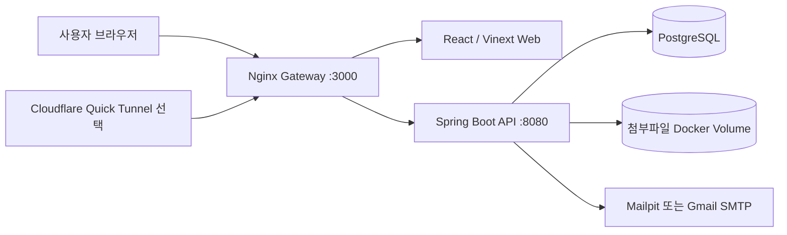

# MoaDay 프로젝트 소개 및 면접 가이드

> 이 문서는 저장소를 처음 보는 면접관이 프로젝트의 목적, 구현 범위, 기술적 판단과 시연 순서를 빠르게 이해하도록 작성한 요약 문서입니다.

## 1. 한 줄 소개

MoaDay는 가족과 친구가 하나의 공간에서 일정, 게시글·첨부파일, 모바일 쿠폰을 함께 관리하는 반응형 협업 웹 서비스입니다.

## 2. 해결하려는 문제

가족이나 친구 모임의 정보는 캘린더, 메신저, 클라우드 저장소, 쿠폰 앱에 흩어지기 쉽습니다. 그 결과 일정과 준비 자료가 분리되고, 공유 쿠폰은 누가 사용할지 충돌하거나 사용 여부가 불분명해집니다.

MoaDay는 다음 세 가지를 하나의 `공간(Space)`으로 묶습니다.

- 일정: 월·주·일 보기, 반복 일정, 참석 응답, 리마인더
- 공유 자료: 게시글, 태그, 댓글, 첨부파일
- 쿠폰: 원본 이미지 또는 바코드, 선점, 사용 완료, 상태 이력

## 3. 핵심 사용자

- 가족 관리자: 가족 일정과 준비물을 공유하고 구성원을 관리합니다.
- 가족 구성원: 초대를 수락하고 일정에 응답하며 자료와 쿠폰을 사용합니다.
- 친구 모임장: 모임 공간을 만들고 일정, 회비 관련 문서, 쿠폰을 공유합니다.
- 친구 구성원: 필요한 자료를 찾고 쿠폰을 선점해 중복 사용을 방지합니다.

## 4. 현재 구현 범위

| 영역 | 구현 내용 |
| --- | --- |
| 인증 | 이메일 회원가입·로그인, 일회용 비밀번호 복구, 로그인 잠금, JWT 버전 무효화, 계정 삭제 |
| 공간 | 개인 공간 자동 생성, 가족·친구 공간, OWNER·ADMIN·MEMBER·VIEWER 권한 |
| 초대 | 7일 유효 토큰, Gmail/Mailpit 메일, 가입자 받은 초대, 수락·거절·취소·만료 |
| 캘린더 | 다중 캘린더, 월·주·일 보기, 반복, 회차 수정·취소·복원, 참석, 알림, ICS 입출력 |
| 공유함 | 게시글 CRUD, 고정, 태그·검색, 댓글, 최대 20개 첨부파일 |
| 쿠폰함 | 이미지·선택적 바코드, 15분 선점, 사용·해제, 만료, 관리자 정정, 감사 이력 |
| 연결 기능 | 일정에 게시글·첨부파일·쿠폰 연결, 통합검색, 오늘 대시보드 |
| 운영 | Docker Compose, PostgreSQL, 파일 볼륨, Mailpit, 백업·복원, Quick Tunnel |

현재 제약과 다음 개발 항목은 [요구사항 명세서](./REQUIREMENTS_SPEC.md)의 범위 밖 항목을 참고합니다.

## 5. 시스템 구성

웹과 API를 Nginx의 동일 출처로 제공해 브라우저의 API 주소와 초대 링크 기준 주소를 단순화했습니다. 로컬 기본 메일은 Mailpit으로 격리하고 `.env` 설정이 있을 때 외부 SMTP를 사용합니다.

## 6. 주요 기술 선택과 이유

### Spring Boot + PostgreSQL

- 서비스 계층에서 공간 멤버십과 역할을 매 요청마다 검증합니다.
- Flyway 마이그레이션 14개로 데이터 구조 변경 이력을 관리합니다.
- 쿠폰 선점 시 비관적 쓰기 잠금을 사용해 동시에 한 명만 성공하도록 합니다.
- 일정과 쿠폰에 낙관적 버전 필드를 두어 동시 수정 충돌을 감지합니다.

### React 기반 반응형 웹

- 데스크톱과 모바일 브라우저를 하나의 코드로 지원합니다.
- 일정, 공유함, 쿠폰함처럼 상호작용이 많은 화면을 컴포넌트 단위로 분리했습니다.
- 모달은 Portal로 렌더링해 상위 컨테이너의 잘림과 위치 문제를 방지합니다.

### Docker Compose

- 웹, API, PostgreSQL, Mailpit, Gateway를 한 명령으로 실행합니다.
- 데이터베이스와 업로드 파일은 이름 있는 볼륨에 보존합니다.
- 개발 환경을 면접관의 PC에서도 재현할 수 있습니다.

## 7. 기술적으로 설명하기 좋은 포인트

### 공간 기반 접근 제어

URL의 `spaceId`를 신뢰하지 않고 DB의 활성 멤버십을 확인합니다. 읽기·쓰기·관리 권한은 OWNER, ADMIN, MEMBER, VIEWER 역할에 따라 서비스 계층에서 판단합니다.

### 쿠폰 선점 경쟁 조건

`SELECT ... FOR UPDATE`에 해당하는 JPA 비관적 잠금으로 쿠폰 레코드를 잠근 뒤 상태를 확인하고 선점합니다. 선점은 기본 15분 후 스케줄러가 자동 해제하며 감사 로그를 남깁니다.

### 반복 일정과 특정 회차 예외

원본 반복 규칙은 유지하면서 특정 발생 시각을 키로 `OVERRIDE` 또는 `CANCELLED` 예외를 저장합니다. 따라서 전체 반복 일정 수정과 특정 회차 수정을 구분할 수 있습니다.

### 파일과 쿠폰 정보 보호

첨부파일은 20MB로 제한하고 실행 파일·스크립트·HTML·SVG 확장자와 파일 시그니처를 차단합니다. 파일과 쿠폰 이미지는 정적 공개 경로가 아니라 인증 API를 통해 제공합니다. 바코드 값은 선점한 사용자에게만 반환합니다.

### 계정 복구와 세션 무효화

복구 토큰 원문은 이메일에만 전달하고 DB에는 SHA-256 해시를 저장합니다. 요청 응답은 가입 여부와 무관하게 같으며, 토큰은 30분·단일 사용으로 제한합니다. 비밀번호가 바뀌면 사용자 보안 버전이 증가해 기존 JWT가 더 이상 보호 API를 통과하지 못합니다.

### 테스트와 복구

- API 통합·단위 테스트: 인증, 권한, 일정, 파일, 쿠폰 경쟁 상태와 이력
- 웹 테스트: 프로덕션 빌드와 서버 렌더링 결과 확인
- E2E 스모크: 세 명의 사용자를 만들고 초대부터 공간 삭제까지 핵심 흐름 실행 후 데이터 정리
- PostgreSQL 덤프와 업로드 볼륨을 함께 백업·복원

## 8. 7분 시연 시나리오

1. 회원가입 후 개인 공간이 자동 생성되는 것을 보여줍니다.
2. 가족 공간을 만들고 다른 이메일을 MEMBER로 초대합니다.
3. 다른 계정에서 받은 초대를 수락합니다.
4. 반복 일정을 만들고 참석자를 지정한 뒤 특정 회차만 변경합니다.
5. 공유글에 파일과 댓글을 추가하고 일정에 연결합니다.
6. 이미지 쿠폰을 등록하고 다른 계정에서 선점한 뒤 사용 완료합니다.
7. 관리자 계정에서 쿠폰 이력과 공간 감사 로그를 확인합니다.
8. 통합검색과 오늘 대시보드에서 세 도메인의 정보가 합쳐지는 것을 보여줍니다.

## 9. 예상 면접 질문과 답변 포인트

### 왜 공간을 최상위 경계로 두었나요?

가족, 친구, 회사처럼 동일 사용자가 여러 그룹에 참여할 수 있기 때문입니다. 데이터마다 `space_id`를 두고 멤버십으로 접근을 검증하면 멀티테넌트 경계가 명확해집니다.

### 쿠폰 중복 선점은 어떻게 막았나요?

애플리케이션의 상태 확인만으로는 경쟁 조건이 생기므로 DB 비관적 잠금을 적용했습니다. 잠금 획득 후 상태를 다시 확인해 첫 요청만 성공시킵니다.

### 파일을 DB에 저장하지 않은 이유는 무엇인가요?

DB에는 메타데이터와 임의의 저장 키만 저장하고 실제 바이트는 볼륨에 보관해 DB 크기와 백업 역할을 분리했습니다. 운영 환경에서는 같은 인터페이스를 S3 호환 저장소로 교체할 수 있습니다.

### 현재 한계는 무엇인가요?

상용 배포, 소셜 로그인, 가입 이메일 인증, 웹 푸시와 오브젝트 스토리지는 아직 구현하지 않았습니다. 현재는 로컬 실행과 기능 검증에 초점을 둔 포트폴리오 단계이며, 계정 복구는 일회용 토큰·로그인 잠금·JWT 무효화까지, 이메일은 DB Outbox·자동 재시도·관리자 이력까지 적용했습니다.

### AI 개발 도구를 사용했다면 어떻게 설명해야 하나요?

실제 사용 범위를 사실대로 설명하고, 본인이 결정한 요구사항·데이터 모델·권한·검증 기준과 직접 확인한 테스트 결과를 중심으로 답변하는 것이 좋습니다. 생성된 코드를 이해하지 못한 상태로 본인이 모두 작성했다고 표현하지 않습니다.

## 10. 빠른 확인 링크

- [로컬 실행 설명서](./SETUP_GUIDE.md)
- [요구사항 명세서](./REQUIREMENTS_SPEC.md)
- [현재 구현 상세 설계서](./DETAILED_DESIGN.md)
- [제품 요구사항 원본](./MVP_PRD.md)
- [제품·시스템 설계 배경](./PRODUCT_DESIGN.md)
