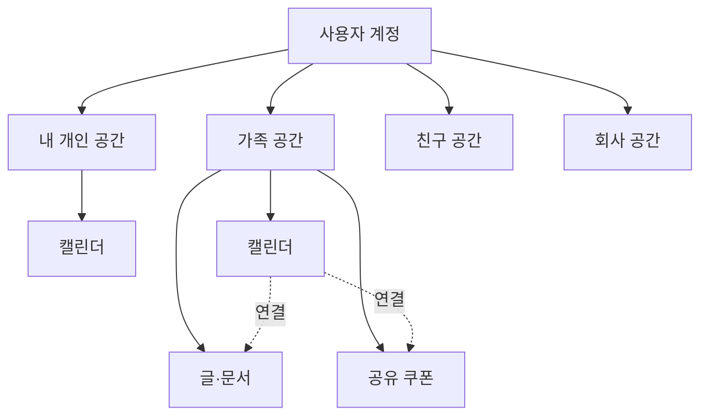
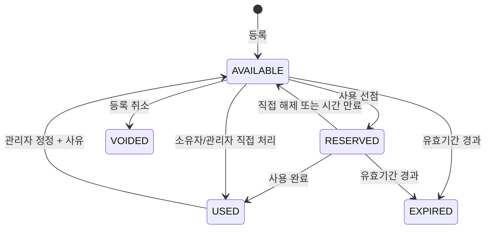
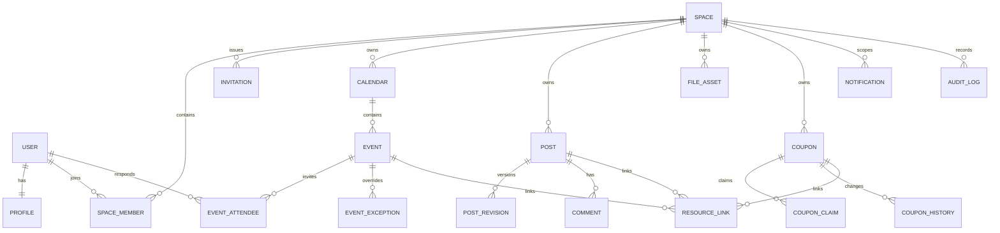
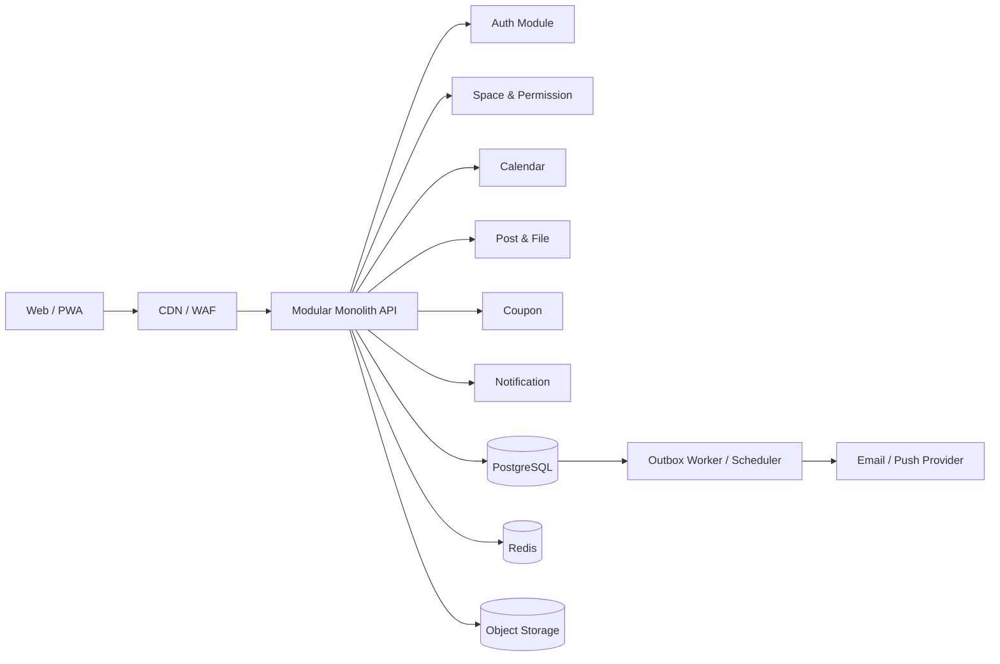

# MoaDay SaaS 제품·시스템 설계서

작성일: 2026-07-13  
상태: 방향 확정 v0.2 — 가족·친구용 반응형 웹/PWA MVP

## 0. 확정된 제품 결정

2026-07-13 사용자 확인으로 아래 방향을 확정했다.

- 첫 고객: 가족과 친구 소그룹
- 첫 플랫폼: 반응형 웹/PWA, iOS·Android 네이티브 앱은 후속 단계
- 문서 기능: 게시글 + 첨부파일 + 댓글. 실시간 공동 편집은 MVP에서 제외
- 회사형 공간: 데이터 모델의 확장성은 유지하되, 초기 화면·가격·온보딩에서는 노출하지 않음
- 초기 제품 목표: 구성원 2~20명 규모의 신뢰 관계 안에서 일정·자료·쿠폰을 함께 관리

## 1. 한 줄 정의

MoaDay는 개인 일정과 가족·친구·회사 그룹의 일정, 글·문서, 모바일 쿠폰을 한 공간에서 안전하게 공유하고 함께 사용하는 협업형 생활 SaaS다.

핵심 차별점은 단순한 공유 캘린더가 아니라 **“함께 알아야 할 것(일정·문서)”과 “함께 써야 할 것(쿠폰)”을 같은 그룹 문맥에서 관리**하는 데 있다.

## 2. 설계 전제와 권고 결론

현재 작업 폴더에는 기존 애플리케이션 코드가 없으므로 신규 구축을 전제로 한다.

- 첫 시장은 한국의 가족·친구 소그룹(B2C/B2F)으로 잡는다.
- 회사 그룹 기능은 같은 기반 위에서 제공하되, 조직도·결재·근태·전자문서까지 MVP에 넣지 않는다.
- 웹과 모바일 앱을 동시에 네이티브로 만들기보다 반응형 웹/PWA로 사용성을 검증한다.
- 모든 데이터를 `공간(Space)`이라는 공통 경계 안에 둔다. 개인 공간도 구성원이 1명인 특수한 공간으로 취급한다.
- 초기 시스템은 마이크로서비스가 아닌 **모듈형 모놀리스**로 구축한다. 서비스 경계는 코드에서 분리하고 배포는 하나로 시작한다.
- 쿠폰 바코드/번호는 목록에서 노출하지 않는다. `사용 선점 → 제한 시간 동안 열람 → 사용 완료 또는 해제` 흐름을 사용한다.
- 서비스가 쿠폰 발행사와 연동되지 않는 한 실제 사용 여부를 자동 검증할 수 없다. 화면에는 `사용자가 표시한 상태`임을 명확히 안내한다.

## 3. 리서치 요약

### 3.1 시장에서 검증된 패턴

| 서비스 | 검증된 패턴 | MoaDay에 반영할 점 |
|---|---|---|
| TimeTree | 여러 공유 캘린더, 일정 주변 커뮤니케이션, 날짜가 없는 메모 | 개인/그룹 캘린더를 동시에 보되 소유 공간과 색상을 분명히 표시 |
| Google Calendar | 캘린더별 공유, `한가함/바쁨만 보기`부터 관리 권한까지 단계화 | 초대 역할과 일정 상세 공개 범위를 분리 |
| Cozi | 가족별 색상, 공유 일정, 할 일/목록, 리마인더 | 가족 사용자는 복잡한 설정보다 오늘 화면과 색상 구분이 중요 |
| Notion | 멤버·게스트·그룹, 콘텐츠별 읽기/댓글/편집 권한 | 회사 사용을 고려해 역할 기반 권한과 콘텐츠 소유자를 구분 |
| 기프티콘 리셀 서비스 | 쿠폰 번호/바코드가 보이면 취소·분쟁 위험이 커짐 | 민감 정보 열람 자체를 기록하고 선점 전에는 바코드를 숨김 |

### 3.2 제품 기회

기존 제품은 보통 아래 중 하나에 강하다.

1. 캘린더 공유
2. 문서·지식 공유
3. 모바일 쿠폰 거래/보관

MoaDay는 이 세 기능을 모두 크게 만드는 제품이 아니라, **소그룹의 일상 협업이라는 하나의 사용 흐름 안에서 세 기능을 가볍게 연결**해야 한다.

예시:

- 가족 여행 일정을 만들고 준비물 문서를 붙인 뒤, 그룹에 공유된 숙박/식사 쿠폰을 연결한다.
- 회사 팀 회식 일정에 장소 안내 글과 사용할 쿠폰을 연결한다.
- 쿠폰 만료 7일 전에 그룹에 알리고, 일정에 `쿠폰 사용 예정`을 추가한다.

### 3.3 표준·보안 조사 결론

- 반복 일정과 외부 캘린더 호환을 위해 iCalendar의 `UID`, `RRULE`, `RECURRENCE-ID` 개념을 따른다.
- SaaS의 가장 큰 보안 위험은 다른 공간의 데이터를 보는 교차 테넌트 유출이다.
- 클라이언트가 보낸 `space_id`만 믿지 않고, 인증된 사용자와 공간 멤버십을 서버에서 매 요청마다 검증해야 한다.
- DB 조회, 캐시 키, 파일 경로, 감사 로그 모두에 공간 식별자를 포함한다.
- 쿠폰 바코드와 번호는 일반 첨부파일보다 민감한 데이터로 분리해 암호화하고, 짧은 만료 시간의 서명 URL로만 제공한다.

## 4. 목표 사용자와 핵심 문제

### 페르소나 A — 가족 관리자

- 구성원 일정이 카카오톡, 종이 달력, 개인 캘린더에 흩어져 있다.
- 가족 모두가 알아야 하는 병원 서류, 여행 자료, 공지사항을 찾기 어렵다.
- 받은 기프티콘을 누가 썼는지 몰라 계산대에서 중복 사용을 시도한다.

### 페르소나 B — 친구 모임 총무

- 약속 일정, 장소 링크, 회비/준비물 안내를 대화방에서 반복해서 찾는다.
- 공동으로 쓰기로 한 쿠폰의 소유자와 사용 여부가 불분명하다.

### 후속 페르소나 — 소규모 회사 팀장

- 팀 일정과 참고 문서를 한 그룹에서 공지하고 싶다.
- 퇴사자/외부 인원의 접근을 즉시 회수하고 변경 이력을 확인해야 한다.

## 5. 제품 정보 구조



### 전역 내비게이션

- 오늘: 모든 권한 있는 공간의 오늘/다가오는 일정, 만료 임박 쿠폰, 최근 공지
- 캘린더: 월/주/일/목록 보기, 공간·캘린더·구성원 필터
- 공유함: 글, 링크, 파일, 댓글
- 쿠폰함: 사용 가능, 선점 중, 사용 완료, 만료
- 공간 전환/관리: 구성원, 역할, 초대, 알림, 감사 이력
- 내 설정: 프로필, 시간대, 알림, 연결 캘린더, 계정/데이터 삭제

## 6. 기능 범위

### 6.1 MVP — 반드시 구현

#### 계정·공간·초대

- 이메일 또는 소셜 로그인
- 개인 공간 자동 생성
- 가족/친구/회사 유형의 그룹 공간 생성
- 이메일 초대와 만료되는 초대 링크
- 초대 수락/거절, 재전송, 취소
- 구성원 역할 변경, 내보내기, 공간 탈퇴/삭제
- 한 사용자의 여러 공간 전환

#### 캘린더

- 여러 캘린더 생성, 색상 지정, 표시/숨김
- 일정 생성·수정·삭제
- 종일 일정, 시간 일정, 장소, URL, 설명
- 참석 구성원 지정과 응답(참석/미정/불참)
- 반복 일정: 매일/매주/매월/매년 및 종료일
- 반복 전체/이번 일정/이후 일정 수정
- 일정별 알림 1개 이상
- 개인 일정의 공개 수준: 상세 공개 / 제목만 / 바쁨만
- 월/주/목록 화면, 공간 및 구성원 필터
- 일정에 관련 글·파일·쿠폰 연결

#### 글·문서 공유

- 제목과 리치 텍스트 본문을 가진 게시글
- 링크와 파일 첨부
- 고정, 태그, 댓글, 작성자/수정일 표시
- 제목·본문 검색
- 파일 다운로드 권한 검사
- 버전 이력은 최근 변경본 복구가 가능한 수준으로 보존

MVP의 `문서`는 Google Docs 같은 실시간 공동 편집기가 아니라, 게시글형 리치 텍스트와 첨부파일을 뜻한다. 실시간 동시 편집은 별도 제품 수준의 복잡도가 있으므로 검증 뒤 추가한다.

#### 쿠폰 공유

- 이미지 업로드 또는 직접 입력
- 브랜드, 상품명, 쿠폰 번호/바코드, 유효기간, 메모
- 대상 공간 선택
- 목록에서 바코드/번호 마스킹
- 사용 가능/선점 중/사용 완료/만료/취소 상태
- 사용 선점과 자동 해제 타이머
- 선점자만 민감 정보 열람
- 사용 완료 시 사용자·시각 기록
- 소유자/관리자의 상태 정정(사유 필수)
- 30일/14일/7일/1일 전 만료 알림 중 선택
- 쿠폰 상태 변경 이력

#### 알림·감사

- 앱 내 알림과 이메일 알림
- 초대, 일정 리마인더, 댓글, 쿠폰 만료/선점/사용 알림
- 중요 작업 감사 로그: 멤버/역할 변경, 파일/쿠폰 열람, 쿠폰 상태 변경
- 사용자별·공간별 알림 켜기/끄기

### 6.2 MVP 이후

- Google/Apple/Outlook 캘린더 읽기 또는 양방향 동기화
- 모바일 네이티브 앱과 푸시 알림
- OCR로 쿠폰 브랜드/상품/유효기간 자동 추출
- 쿠폰 발행사 API를 통한 실제 사용 상태 확인(제휴 가능할 때만)
- 실시간 문서 공동 편집
- 할 일, 장보기 목록, 투표, 일정 후보 조율
- 회사용 SSO, SCIM, 부서 그룹, 보존 정책, 관리자 내보내기
- 사진 앨범, 위치 공유, AI 일정/문서 요약

### 6.3 의도적으로 제외

- MVP에서 쿠폰 판매, 결제, 정산, 에스크로를 제공하지 않는다.
- 주민등록번호, 카드번호 등 고위험 개인정보를 수집하지 않는다.
- 회사용 근태/급여/결재 시스템을 만들지 않는다.
- 공개 커뮤니티나 불특정 다수 쿠폰 공유를 제공하지 않는다.

## 7. 권한 모델

### 7.1 공간 역할

| 작업 | 소유자 | 관리자 | 멤버 | 열람자 |
|---|:---:|:---:|:---:|:---:|
| 공간 삭제/소유권 이전 | O | X | X | X |
| 결제/플랜 관리 | O | 선택 | X | X |
| 멤버 초대·제거·역할 변경 | O | O | X | X |
| 모든 일정/글 관리 | O | O | X | X |
| 본인 일정/글 생성·수정 | O | O | O | X |
| 공개된 콘텐츠 열람 | O | O | O | O |
| 쿠폰 등록 | O | O | O | X |
| 쿠폰 선점·열람·사용 처리 | O | O | 권한 있을 때 | X |
| 감사 로그 열람 | O | O | X | X |

### 7.2 권한 구현 방식

역할만으로 모든 경우를 해결하지 않고, 아래 속성을 함께 검사하는 혼합 모델을 사용한다.

`허용 여부 = 공간 멤버십 × 공간 역할 × 리소스 공개 수준 × 작성자/선점자 관계 × 리소스 상태`

예시:

- 멤버는 본인이 쓴 글은 수정할 수 있지만 다른 멤버의 글은 수정하지 못한다.
- 관리자는 모든 글을 관리할 수 있다.
- 쿠폰이 `RESERVED`이면 선점자와 관리자 외에는 바코드를 볼 수 없다.
- 개인 일정이 `BUSY_ONLY`이면 그룹 화면에는 제목·설명 없이 시간 블록만 보인다.

권한 판단은 UI가 아니라 API와 데이터 접근 계층에서 강제한다.

## 8. 핵심 사용자 흐름

### 8.1 가입과 첫 그룹 생성

1. 로그인한다.
2. 개인 공간과 기본 캘린더가 자동 생성된다.
3. `공간 만들기`에서 가족/친구/회사 중 용도를 선택한다.
4. 이름과 기본 시간대를 정한다.
5. 이메일 또는 초대 링크로 구성원을 초대한다.
6. 초대받은 사람은 로그인 후 대상 공간과 부여될 역할을 확인하고 수락한다.

### 8.2 일정과 자료 연결

1. 사용자가 그룹 캘린더에 일정을 만든다.
2. 기존 글/파일/쿠폰을 연결하거나 일정 화면에서 새로 만든다.
3. 참석자를 지정하고 알림 시점을 정한다.
4. 참석자는 알림에서 일정과 연결 자료를 한 번에 확인한다.

### 8.3 쿠폰 사용



1. 사용자가 쿠폰 목록에서 `사용할게요`를 누른다.
2. 서버는 단일 DB 트랜잭션으로 현재 상태와 버전을 검사해 한 사람만 선점시킨다.
3. 선점자는 제한 시간 동안만 바코드를 열 수 있다.
4. 매장에서 사용 후 `사용 완료`를 누른다.
5. 다른 구성원에게 상태가 즉시 반영되고 소유자에게 알림이 간다.
6. 완료하지 않으면 선점이 자동 해제된다.

주의: 업로더가 원본 쿠폰을 별도로 갖고 있거나 선점자가 화면을 캡처한 경우까지 기술적으로 통제할 수는 없다. 서비스는 열람/상태 이력으로 분쟁을 줄이는 역할을 한다.

## 9. 도메인 및 데이터 모델

### 9.1 핵심 원칙

- 공개 ID는 추측하기 어려운 UUIDv7/ULID 계열을 사용한다.
- 모든 공간 소속 테이블은 `space_id`를 갖는다.
- 모든 시간은 DB에 UTC로 저장하고 사용자의 IANA 시간대(`Asia/Seoul`)로 표시한다.
- 반복 일정 원본과 예외 일정을 구분한다.
- 중요한 변경은 덮어쓰지 않고 이력 또는 감사 로그를 남긴다.
- 쿠폰 번호/바코드 원본은 애플리케이션 수준 암호화 대상이다.

### 9.2 개념 ERD



### 9.3 주요 테이블

#### 계정과 공간

- `users`: id, email, auth_provider, status, created_at, deleted_at
- `profiles`: user_id, display_name, avatar_key, locale, timezone
- `spaces`: id, type(PERSONAL/FAMILY/FRIENDS/COMPANY), name, owner_user_id, timezone, plan, status
- `space_members`: space_id, user_id, role, coupon_redeem_allowed, status, joined_at
- `invitations`: id, space_id, email, role, token_hash, expires_at, accepted_at, revoked_at

#### 캘린더

- `calendars`: id, space_id, name, color, visibility, created_by
- `events`: id, space_id, calendar_id, uid, title, description, location, starts_at, ends_at, all_day, timezone, rrule, visibility, version, created_by
- `event_exceptions`: id, event_id, recurrence_id, override fields, cancelled
- `event_attendees`: event_id, user_id, response, responded_at
- `reminders`: id, event_id, user_id(nullable), channel, minutes_before

`uid`는 외부 캘린더 호환용 불변 식별자이고, `rrule`은 RFC 5545 형식을 저장한다. 무한 반복 일정의 개별 발생 건을 DB에 전부 미리 만들지 않고 조회 범위에서 계산·캐시한다.

#### 글·파일

- `posts`: id, space_id, title, content_json, content_text, pinned, created_by, updated_by, version
- `post_revisions`: id, post_id, version, content_json, edited_by, created_at
- `comments`: id, space_id, post_id, body, created_by, deleted_at
- `file_assets`: id, space_id, storage_key, original_name, media_type, size, sha256, scan_status, created_by
- `resource_links`: id, space_id, source_type/id, target_type/id

#### 쿠폰

- `coupons`: id, space_id, owner_user_id, brand, product_name, expires_on, status, encrypted_code, masked_code, barcode_asset_id, version, created_at
- `coupon_claims`: id, coupon_id, claimed_by, claimed_at, lease_expires_at, revealed_at, completed_at, released_at
- `coupon_history`: id, coupon_id, actor_user_id, from_status, to_status, reason, metadata, created_at

`coupons(status, expires_on)`, `coupons(space_id, status)`, `events(calendar_id, starts_at)`에 인덱스를 둔다. 쿠폰 선점은 `status='AVAILABLE' AND version=:expected` 조건부 갱신 또는 행 잠금으로 원자성을 보장한다.

## 10. 시스템 아키텍처

### 10.1 권장 기술 구성

| 영역 | 권장안 | 이유 |
|---|---|---|
| 웹/PWA | React 기반 SSR 프레임워크 + TypeScript | 반응형 웹, SEO가 필요한 랜딩, PWA를 한 코드베이스로 제공 |
| API | Spring Boot 모듈형 모놀리스 | 인증·트랜잭션·백그라운드 작업과 장기 유지보수에 적합 |
| DB | PostgreSQL | 트랜잭션, JSON, 전문 검색, RLS 선택지 |
| 캐시/락 | Redis | 세션/요청 제한/짧은 캐시. 쿠폰 최종 상태의 진실은 PostgreSQL 유지 |
| 파일 | S3 호환 오브젝트 스토리지 + CDN | 첨부파일과 쿠폰 이미지의 분리 저장, 서명 URL |
| 비동기 | DB Transactional Outbox + Worker | 알림 유실/중복을 제어하고 초기 메시지 브로커 복잡도 회피 |
| 알림 | 이메일 + Web Push/FCM | MVP는 이메일/앱 내, 이후 네이티브 푸시 확장 |
| 관측 | 구조화 로그, 오류 추적, 메트릭/알람 | 요청·공간 상관관계와 보안 이벤트 추적 |

프론트엔드/백엔드 기술은 팀 역량에 맞춰 바꿀 수 있으나, PostgreSQL의 트랜잭션을 쿠폰 선점의 최종 권위로 두는 원칙은 유지해야 한다.

### 10.2 런타임 구성



### 10.3 백엔드 모듈 경계

- Identity: 로그인, 세션/토큰, 프로필, 계정 삭제
- Spaces: 공간, 멤버십, 초대, 역할, 플랜/사용량
- Calendar: 캘린더, 일정, 반복, 참석, 리마인더
- Content: 게시글, 개정, 댓글, 파일, 검색
- Coupons: 등록, 선점, 민감 정보 열람, 상태/이력, 만료
- Notifications: 앱 내 알림, 이메일/푸시, 사용자 설정
- Audit: 보안/관리 작업 기록 및 조회
- Billing(후속): 구독, 사용량, 결제 웹훅

모듈은 서로의 테이블을 임의 수정하지 않고 공개된 애플리케이션 서비스나 도메인 이벤트를 통해 연동한다. 예를 들어 쿠폰 사용 완료 후 `CouponUsed` 이벤트가 Outbox에 기록되고 알림 모듈이 이를 전달한다.

## 11. API 초안

공통 규칙:

- `/api/v1` 버전 접두어
- 변경 요청은 `Idempotency-Key` 지원
- 수정은 `version` 또는 `If-Match`로 충돌 감지
- 목록은 cursor pagination 사용
- 응답에는 내부 저장소 경로와 암호화 원문을 포함하지 않음

```text
POST   /api/v1/spaces
GET    /api/v1/spaces
POST   /api/v1/spaces/{spaceId}/invitations
POST   /api/v1/invitations/{token}/accept
PATCH  /api/v1/spaces/{spaceId}/members/{userId}

POST   /api/v1/spaces/{spaceId}/calendars
GET    /api/v1/events?from=&to=&spaceIds=&calendarIds=
POST   /api/v1/calendars/{calendarId}/events
PATCH  /api/v1/events/{eventId}?scope=this|following|series
POST   /api/v1/events/{eventId}/responses

GET    /api/v1/spaces/{spaceId}/posts
POST   /api/v1/spaces/{spaceId}/posts
PATCH  /api/v1/posts/{postId}
POST   /api/v1/posts/{postId}/comments
POST   /api/v1/spaces/{spaceId}/files/upload-intents

GET    /api/v1/spaces/{spaceId}/coupons?status=
POST   /api/v1/spaces/{spaceId}/coupons
POST   /api/v1/coupons/{couponId}/claims
DELETE /api/v1/coupons/{couponId}/claims/current
POST   /api/v1/coupons/{couponId}/reveal
POST   /api/v1/coupons/{couponId}/complete
POST   /api/v1/coupons/{couponId}/correct

GET    /api/v1/notifications
POST   /api/v1/notifications/{notificationId}/read
GET    /api/v1/spaces/{spaceId}/audit-logs
```

`reveal`은 선점 상태와 사용자를 다시 검증하고, 짧은 수명의 URL 또는 일회성 응답을 반환하며 감사 로그를 남긴다.

## 12. 보안·개인정보·운영 정책

### 12.1 테넌트 격리

- 인증 세션의 사용자 ID로 `space_members`를 조회해 공간 문맥을 확정한다.
- 모든 Repository 메서드는 `space_id + resource_id` 복합 조건을 사용한다.
- PostgreSQL RLS를 방어 계층으로 추가하고 교차 공간 접근 회귀 테스트를 운영한다.
- Redis 키는 `space:{spaceId}:...`, 파일은 해시된 공간 접두어로 격리한다.
- 운영자 접근도 별도 권한, 사유, 만료 시간, 감사 기록 없이는 허용하지 않는다.

### 12.2 쿠폰과 파일 보호

- TLS 전송 암호화, 저장소 암호화, 쿠폰 코드 애플리케이션 암호화
- 암호화 키는 코드/DB가 아닌 키 관리 서비스에 보관하고 회전 가능하게 설계
- 쿠폰 이미지에 공개 CDN URL을 사용하지 않음
- 다운로드/열람 전에 매번 권한과 상태 검사
- 업로드 파일 확장자·MIME·크기 검증, 악성코드 검사, 이미지 메타데이터 제거
- 로그/오류 추적에 쿠폰 번호, 초대 토큰, 파일 서명 URL을 남기지 않음
- 초대 토큰은 원문이 아닌 해시만 DB에 저장

### 12.3 개인정보

- 가입에 필요한 최소 정보만 수집하고 수집 목적·보유 기간을 고지한다.
- 마케팅 수신 동의는 서비스 필수 동의와 분리한다.
- 탈퇴/공간 삭제 시 법적 보존 의무가 없는 개인정보와 파일을 정해진 유예 후 파기한다.
- 사용자 데이터 내보내기와 계정 삭제 흐름을 제품 기능으로 제공한다.
- 처리위탁(호스팅, 이메일, 오류 추적 등)과 국외 이전 여부를 출시 전 개인정보 처리방침에 반영한다.
- 미성년자 사용을 허용할지 별도 정책으로 결정한다. 초기에는 만 14세 이상으로 제한하는 방안이 단순하다.

### 12.4 쿠폰 정책

- 발행사 약관상 양도·공유가 제한된 쿠폰은 등록하지 않도록 이용약관과 등록 화면에서 고지한다.
- 현금성 상품권, 신분 확인이 필요한 쿠폰 등 고위험 유형은 초기 등록 제한을 검토한다.
- 플랫폼은 쿠폰의 유효성·잔액·실사용을 보증하지 않는다는 점을 표시한다.
- 신고/삭제/분쟁 접수와 감사 이력 보존 기간을 정한다.
- 향후 판매·중개·정산을 추가하면 전자상거래, 통신판매중개, 결제 및 환불 정책을 별도 법률 검토해야 한다.

법률 관련 내용은 제품 설계 체크리스트이며 정식 법률 자문을 대체하지 않는다.

## 13. 동시성·오류 처리 핵심

### 쿠폰 선점

```text
BEGIN
UPDATE coupons
   SET status = 'RESERVED', version = version + 1
 WHERE id = :couponId
   AND space_id = :authorizedSpaceId
   AND status = 'AVAILABLE'
   AND version = :expectedVersion;

if affected_rows != 1 -> 409 COUPON_ALREADY_CLAIMED
INSERT coupon_claims (...);
INSERT coupon_history (...);
INSERT outbox_events (...);
COMMIT
```

- Redis 분산 락만으로 정합성을 보장하지 않는다.
- 작업 재시도에 대비해 멱등 키를 사용한다.
- Worker가 만료된 선점을 해제하되, DB 조건부 갱신으로 이미 완료된 쿠폰을 되돌리지 않는다.

### 일정 수정

- 사용자가 오래된 일정 편집 화면에서 저장하면 `version` 불일치로 409를 반환한다.
- 반복 일정은 `이번 일정`, `이후 일정`, `전체 일정` 범위를 명시하지 않으면 수정하지 않는다.
- DST가 있는 시간대는 현지 시작 시간과 IANA 시간대를 함께 보존한다.

## 14. 검색과 알림

### 검색

MVP는 PostgreSQL 전문 검색으로 글 제목/본문, 일정 제목, 쿠폰 브랜드/상품명을 검색한다. 쿠폰 번호는 검색 인덱스에 넣지 않는다. 한국어 검색 품질 요구가 커질 때 별도 검색 엔진을 검토한다.

검색 결과에도 조회 권한을 먼저 적용한다. 검색 인덱스가 다른 공간의 제목을 자동완성으로 노출하지 않도록 한다.

### 알림

- API 트랜잭션에서 도메인 데이터와 Outbox를 함께 커밋한다.
- Worker는 적어도 한 번 전달을 전제로 중복 방지 키를 사용한다.
- 사용자·공간·알림 유형별 설정과 조용한 시간대를 둔다.
- 일정 리마인더와 쿠폰 만료 작업은 사용자 시간대를 기준으로 예약한다.

## 15. 비기능 요구사항

MVP 목표치:

- API 일반 읽기 p95 500ms 이하(파일 업로드 제외)
- 월/주 캘린더 조회 p95 1초 이하
- 서비스 월 가용성 목표 99.9%
- DB 일일 백업 + 시점 복구, 복구 훈련 정기 수행
- RPO 15분 이내, RTO 4시간 이내를 초기 목표로 설정
- 사용자 화면/감사 로그의 날짜·시간대 일관성
- 웹 접근성: 키보드 탐색, 명암, 폼 레이블, 색상 외 상태 표현
- 모바일 우선 반응형 디자인

용량 가정은 초기 검증값으로 둔다.

- 공간당 기본 멤버 20명
- 파일당 20MB, 공간당 1GB 무료 한도 후보
- 일정 조회 범위 최대 1년
- 초대/로그인/쿠폰 열람 API에 사용자·IP·공간별 요청 제한

## 16. SaaS 플랜 가설

정확한 가격은 사용자 인터뷰와 운영비 측정 후 결정한다.

| 플랜 | 대상 | 가설 기능 |
|---|---|---|
| Free | 개인/소규모 가족 | 개인 공간, 그룹 1개, 제한된 멤버·저장공간, 기본 알림 |
| Family Plus | 가족/친구 | 그룹·저장공간 확대, 고급 알림, 캘린더 연동, 변경 이력 |
| Team | 소규모 회사 | 멤버당 과금, 관리자/감사 로그, 보존 정책, 향후 SSO |

초기에는 결제보다 핵심 행동 지표를 먼저 검증한다.

- 가입 후 24시간 내 그룹 생성률
- 그룹 생성 후 초대 수락률
- 주간 활성 그룹 비율
- 그룹당 주간 일정/글/쿠폰 생성 수
- 등록 쿠폰 중 만료 전 사용 처리율
- 쿠폰 선점 충돌/정정/신고율
- 4주 그룹 유지율

## 17. 개발 단계와 예상 작업량

1명의 숙련된 풀스택 개발자 기준의 거친 추정이며 디자인/법률/스토어 심사는 별도다.

### 단계 0 — 제품 검증, 1~2주

- 가족 5명, 친구 모임 5명, 소규모 회사 5명 이상 인터뷰
- 가장 자주 공유하는 일정/자료/쿠폰 사례 수집
- 클릭 가능한 프로토타입으로 초대와 쿠폰 선점 테스트
- MVP 성공 지표 확정

### 단계 1 — 기반, 2주

- 모노레포/CI/CD/환경 구성
- 로그인, 개인 공간, 그룹, 초대, 역할
- 공간 격리 테스트와 감사 로그 기반

### 단계 2 — 캘린더, 2~3주

- 캘린더 UI, 일정 CRUD, 반복/예외, 참석, 리마인더
- 시간대/DST/동시 수정 테스트

### 단계 3 — 글·파일, 1~2주

- 게시글, 첨부파일, 댓글, 버전, 검색
- 서명 URL, 파일 검사, 권한 테스트

### 단계 4 — 쿠폰, 2주

- 등록/마스킹, 선점/열람/완료/해제, 만료 알림
- 동시 선점 부하 테스트와 이력/정정

### 단계 5 — 베타 준비, 1~2주

- 앱 내/이메일 알림, 온보딩, 사용량 제한
- 개인정보/약관/탈퇴/삭제, 백업/복구
- 접근성, 모바일 QA, 관측/알람, 베타 배포

합계: 핵심 MVP 약 9~13주. 네이티브 앱, 외부 캘린더 양방향 연동, OCR은 이 범위에 포함하지 않는다.

## 18. 테스트 전략과 출시 게이트

### 자동화 우선순위

- 두 개의 공간을 만든 뒤 A 공간 데이터가 B 공간 사용자에게 절대 노출되지 않는 교차 테넌트 테스트
- 모든 역할 × 엔드포인트 권한 매트릭스 테스트
- 동시에 100명이 같은 쿠폰을 선점해도 한 건만 성공하는 테스트
- 쿠폰 선점 만료와 사용 완료 작업의 경쟁 조건 테스트
- 반복 일정의 월말, 윤년, DST, 예외 수정 테스트
- 초대 토큰 만료/재사용/취소 테스트
- 파일 URL 추측·재사용·권한 회수 테스트
- Outbox 재처리 시 알림 중복 방지 테스트

### 베타 출시 조건

- 치명/높음 등급 보안 취약점 0건
- 권한 매트릭스와 교차 공간 테스트 100% 통과
- 백업에서 복구 리허설 완료
- 계정 탈퇴와 공간 삭제의 실제 파기 작업 확인
- 최소 3개 실제 그룹이 2주간 일정·문서·쿠폰 흐름을 사용
- 쿠폰 중복 사용 시도와 사용자 혼동 사례를 인터뷰로 확인

## 19. 확정된 제품 방향과 남은 세부 결정

확정:

1. 가족·친구를 첫 고객으로 한다.
2. 반응형 웹/PWA를 먼저 만들고 iOS·Android 앱은 후속 개발한다.
3. 게시글+첨부파일+댓글을 MVP로 만들며 실시간 공동 편집은 제외한다.

개발 중 사용자 확인이 필요한 세부 결정:

- 로그인: 카카오/네이버/구글 중 우선 제공할 소셜 로그인
- 쿠폰: 직접 입력만 할지, 이미지 OCR을 첫 버전에 포함할지
- 초대 대상에 만 14세 미만 가족 구성원을 허용할지
- 회사 데이터에 필요한 보존 기간과 관리자 감사 범위
- 유료화 시점과 Family/Team 중 먼저 검증할 플랜

## 20. 다음 산출물

확정된 방향에 따라 다음 순서로 구체화한다.

1. 화면별 PRD와 사용자 스토리/인수 조건
2. 화면 흐름 및 와이어프레임
3. OpenAPI 상세 명세와 오류 코드
4. 물리 DB 스키마/마이그레이션
5. 저장소 구조와 개발 환경 구성
6. 단계 1(로그인·공간·초대) 구현

## 참고 자료

- [TimeTree 공식 사이트](https://timetreeapp.com/intl/en)
- [TimeTree 메모 기능 도움말](https://support.timetreeapp.com/hc/en-us/articles/207392706-I-want-to-register-and-view-memos)
- [Google Calendar 공유 권한 도움말](https://support.google.com/calendar/answer/15716974?hl=en-GB)
- [Cozi 기능 개요](https://www.cozi.com/feature-overview/)
- [Notion 공유 및 권한 도움말](https://www.notion.com/en-gb/help/sharing-and-permissions)
- [IETF RFC 5545 — iCalendar](https://datatracker.ietf.org/doc/html/rfc5545)
- [OWASP Multi-Tenant Security Cheat Sheet](https://cheatsheetseries.owasp.org/cheatsheets/Multi_Tenant_Security_Cheat_Sheet.html)
- [OWASP Authorization Cheat Sheet](https://cheatsheetseries.owasp.org/cheatsheets/Authorization_Cheat_Sheet.html)
- [개인정보 보호법 제15조 — 국가법령정보센터](https://law.go.kr/LSW/lsLinkCommonInfo.do?ancYnChk=&chrClsCd=010202&lsJoLnkSeq=1020398481)
